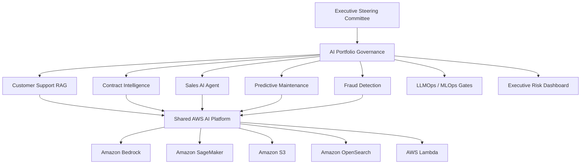

# Senior AI Technical Project Manager Portfolio

[](./enterprise-rag-aws/)
[](./llmops-delivery-framework/)
[](./ai-portfolio-governance/)
[](./ai-program-risk-dashboard/)

## Executive summary

This portfolio demonstrates how I would lead a multi-project enterprise AI program from **business case and architecture through Agile execution, production readiness, risk governance, and executive reporting**.

The portfolio is organized around the fictional **Northstar Enterprise AI Transformation Program** so that every artifact fits into one coherent delivery story.

## Portfolio at a glance

| Area | What it proves | Open |
|---|---|---|
| Enterprise RAG on AWS | GenAI + AWS architecture, backlog, security, IaC, release governance | [View](./enterprise-rag-aws/) |
| AI Portfolio Governance | Multi-project health, budget, dependencies, RAID, steering decisions | [View](./ai-portfolio-governance/) |
| Agentic AI Governance | Human approval, tool authorization, runtime policy boundaries | [View](./agentic-ai-governance/) |
| LLMOps Delivery Framework | AI-specific lifecycle gates, observability, incidents, release criteria | [View](./llmops-delivery-framework/) |
| AI Program Risk Dashboard | Executive visualization of delivery and AI KPIs | [View](./ai-program-risk-dashboard/) |
| AI TPM Playbook | Reusable charters, readiness reviews, Scrum cadence and governance templates | [View](./ai-project-manager-playbook/) |

## Northstar program architecture



## What I want an interviewer to see

- I can manage **multiple concurrent AI initiatives**, not only one prototype.
- I understand enough architecture to challenge assumptions and sequence work credibly.
- I treat **AI evaluation, security, cost, and operations** as delivery gates—not afterthoughts.
- I can convert technical progress into **decision-oriented executive reporting**.
- I know how to govern AI agents with authorization boundaries and human approval.
- I use Agile ceremonies to improve flow and evidence, not to create meeting overhead.

## Suggested interview walkthrough

1. Start with [AI Portfolio Governance](./ai-portfolio-governance/) to show portfolio-level leadership.
2. Open [Enterprise RAG on AWS](./enterprise-rag-aws/) for architecture, backlog and production-readiness depth.
3. Show [Agentic AI Governance](./agentic-ai-governance/) for modern GenAI risk controls.
4. Open [LLMOps Delivery Framework](./llmops-delivery-framework/) to explain how AI delivery differs from normal software delivery.
5. Finish with the [AI Program Risk Dashboard](./ai-program-risk-dashboard/) and [Role Match](./docs/ROLE_MATCH.md).

## Repository map

```text
Generative-AI/
├── enterprise-rag-aws/
├── ai-portfolio-governance/
├── agentic-ai-governance/
├── llmops-delivery-framework/
├── ai-program-risk-dashboard/
├── ai-project-manager-playbook/
└── docs/
    └── ROLE_MATCH.md
```

## Scope note

All business names, budgets, metrics and scenarios in the Northstar program are fictional and created for portfolio demonstration. Reference architectures and controls are intended to show technical-delivery fluency and governance judgment; they do not claim production deployment of every illustrated component.
