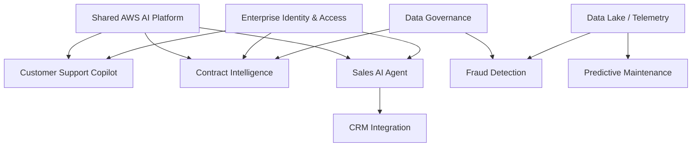

# Cross-Project Dependency Map

```mermaid
flowchart TD
    P[Shared AWS AI Platform] --> A[Customer Support Copilot]
    P --> B[Contract Intelligence]
    P --> C[Sales AI Agent]
    D[Enterprise Identity & Access] --> A
    D --> B
    D --> C
    E[Data Governance] --> B
    E --> F[Fraud Detection]
    G[Data Lake / Telemetry] --> H[Predictive Maintenance]
    G --> F
    C --> I[CRM Integration]
```

## Dependency governance
Every material dependency has:
- supplying owner;
- consuming owner;
- need-by date;
- confidence status;
- fallback or escalation path.
