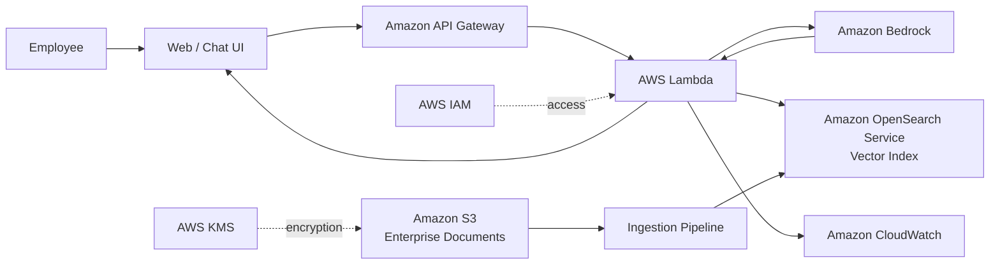

# Enterprise RAG on AWS

Reference delivery blueprint for a secure enterprise knowledge assistant using Retrieval-Augmented Generation (RAG) on AWS.

## Business objective
Reduce time employees spend searching policies, procedures and technical knowledge while preserving source traceability, access controls and measurable answer quality.

## Reference architecture

## Success measures
| KPI | Target |
|---|---:|
| Grounded answer rate | >= 95% |
| Citation precision | >= 95% |
| P95 response latency | <= 5 sec |
| Unsupported answer rate | <= 3% |
| User task success | >= 85% |
| Sev-1 security findings at launch | 0 |

> Demonstration reference architecture. AWS resources and commercial figures are illustrative.
