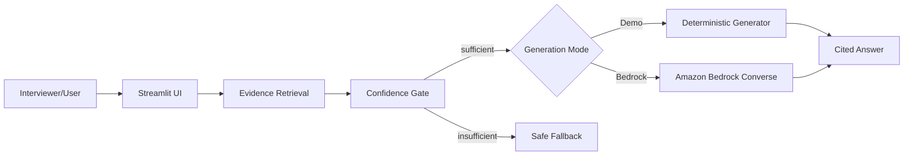

# Live Bedrock-Ready RAG Demo

A small, deployable portfolio demo with **two operating modes**:

- **Demo Mode** — works immediately without AWS inference. Retrieval, evidence gating, citations, UI, and governance are fully functional.
- **Bedrock Mode** — uses the Amazon Bedrock Converse API for generation once Bedrock Runtime access is enabled.

## Why two modes?

The portfolio should be demonstrable even when a cloud account is temporarily blocked by account-level model quotas or approvals. Demo Mode is clearly labeled and does **not** pretend to be an LLM.

## Run immediately

```bash
cd enterprise-rag-aws/live-demo
pip install -r requirements.txt
streamlit run app.py
```

No AWS credentials are needed in Demo Mode.

## Switch to Amazon Bedrock

```bash
export GENERATION_MODE=bedrock
export AWS_REGION=us-west-2
export BEDROCK_MODEL_ID=us.amazon.nova-lite-v1:0
streamlit run app.py
```

Use standard AWS SDK credentials or an approved runtime identity. Do **not** commit credentials.

## Interview questions to try

- What is required before an AI solution can move to production?
- When does an AI agent require human approval?
- How is the Northstar AI portfolio governed?
- What happens when authorization is ambiguous?

## Architecture



## Production evolution

For an enterprise implementation, replace local document retrieval with a governed vector layer such as OpenSearch or an approved Bedrock Knowledge Base pattern, and deploy with IAM roles, KMS, CloudWatch, and enterprise access controls.
